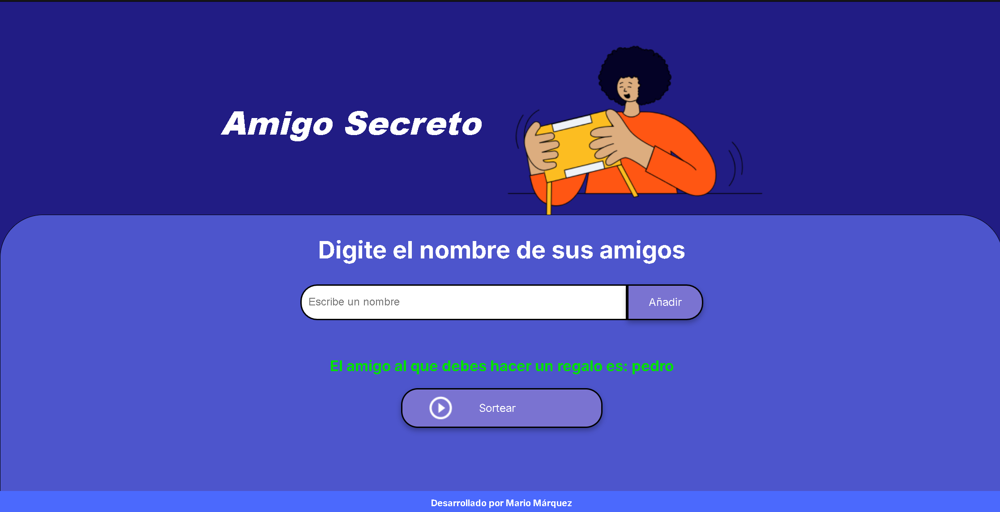

# -Challenge-ONE-Logica-de-Programacion---Amigo-secreto
Creación de aplicación web de amigo secreto, como parte de la formación en programación en HTML y CSS

# 🎉 Juego de Amigo Secreto

## 📋 Índice
1. [Descripción del Proyecto](#📖-descripción-del-proyecto)
2. [Estado del Proyecto](#🚧-estado-del-proyecto)
3. [Demostración de Funciones y Aplicaciones](#✨-demostración-de-funciones-y-aplicaciones)
4. [Tecnologías Utilizadas](#🛠️-tecnologías-utilizadas)
5. [Persona Desarrolladora del Proyecto](#👨‍💻-persona-desarrolladora-del-proyecto)
6. [Licencia](#📝-licencia)

## 📖 Descripción del Proyecto
El **Juego de Amigo Secreto** es una aplicación desarrollada por el alumno0 de ALURA LATAM Mario Márquez para aprender los elementos básicos de programación en **HTML**, **CSS** y **JavaScript**. El juego permite a los usuarios participar en una dinámica para la asignación aleatoria a cada participante de un "amigo secreto".  
Esta aplicación es de **código abierto** y es el challenge de cierre para la etapa de “Inicio a la programación” de **Alura LATAM**.

## 🚧 Estado del Proyecto
El proyecto se encuentra actualmente **CERRADO**, pero su código está disponible en GitHub.

## ✨ Demostración de Funciones y Aplicaciones
El juego de amigo secreto ofrece las siguientes funciones:
- Registro de nombres de los participantes.
- Generación aleatoria del amigo secreto para cada participante.
- Interfaz visual amigable con imágenes alojadas en la carpeta `assets`.

Aquí tienes una vista previa del juego:

### Pantalla Inicial

### Resultado del Juego 1

### Resultado del Juego 2

## 🛠️ Tecnologías Utilizadas
- **HTML5**: Estructura de la aplicación.
- **CSS3**: Estilización y diseño de la interfaz.
- **JavaScript**: Lógica y funcionamiento del juego.
- **Imágenes PNG** alojadas en la carpeta `assets`.

## 👨‍💻 Persona Desarrolladora del Proyecto
- **Nombre**: Mario Márquez
- **Formación**: Alumno de “Inicio a la programación” de **Alura LATAM**.

## 📝 Licencia
Este proyecto no tiene una licencia asociada.

